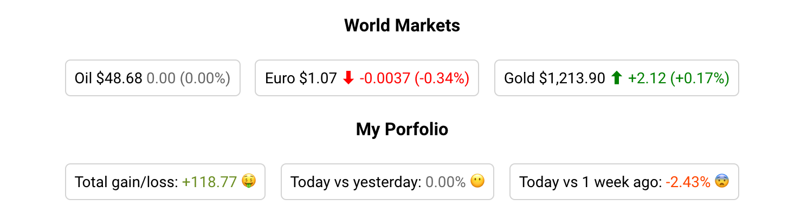

[](https://www.webcomponents.org/element/valdrinkoshi/stock-value)
[](https://travis-ci.org/valdrinkoshi/stock-value)

# stock-value
Web Component to display stock value.

## Installation
```
bower install --save valdrinkoshi/stock-value
```

## Usage
Drop `<stock-value>` in, provide the `current` and `previous` values, and see if your stock is ⬆ or ⬇.

Example:
<!--
```
<custom-element-demo>
  <template>
    <script src="../webcomponentsjs/webcomponents-loader.js"></script>
    <link rel="import" href="stock-value.html">
    <style>
      body {
        text-align: center;
        font-family: 'Roboto', 'Noto', sans-serif;
        font-weight: normal;
        font-size: 14px;
        -webkit-font-smoothing: antialiased;
      }
      span {
        display: inline-block;
        padding: 8px;
        margin: 5px;
        border-radius: 5px;
        border: 1px solid lightgray;
        line-height: 1rem;
      }
    </style>
    <next-code-block></next-code-block>
  </template>
</custom-element-demo>
```
-->
```html
<h3>World Markets</h3>
<span>Oil $48.68 <stock-value current="48.68" previous="48.68"></stock-value></span>
<span>Euro $1.07 <stock-value current="1.081421" previous="1.085135"></stock-value></span>
<span>Gold $1,213.90 <stock-value current="1213.90123" previous="1211.781"></stock-value></span>

<custom-style><style is="custom-style">
  stock-value.styled-stock {
    --stock-value-up-symbol: '🤑';
    --stock-value-up-color: olivedrab;
    --stock-value-down-symbol: '😨';
    --stock-value-down-color: orangered;
    --stock-value-neutral-symbol: '😶';
    --stock-value-neutral-color: dimgrey;
    --stock-value-symbol-margin: 0 4px;
  }
</style></custom-style>
<h3>My Porfolio</h3>
<span>
  Total gain/loss:
  <stock-value class="styled-stock" current="120.12" previous="1.35" only="difference" suffix-symbol></stock-value>
</span>
<span>
  Today vs yesterday:
  <stock-value class="styled-stock" current="120.12" previous="120.12" only="percent" suffix-symbol></stock-value>
</span>
<span>
  Today vs 1 week ago:
  <stock-value class="styled-stock" current="120.12" previous="123.11" only="percent" suffix-symbol></stock-value>
</span>
```
Screenshot:



[APIs](https://www.webcomponents.org/element/valdrinkoshi/stock-value)

## Contributing

1. Fork it on Github.
2. Create your feature branch: `git checkout -b my-new-feature`
3. Commit your changes: `git commit -am 'Add some feature'`
4. Push to the branch: `git push origin my-new-feature`
5. Submit a pull request

## License

[MIT](https://opensource.org/licenses/MIT)
